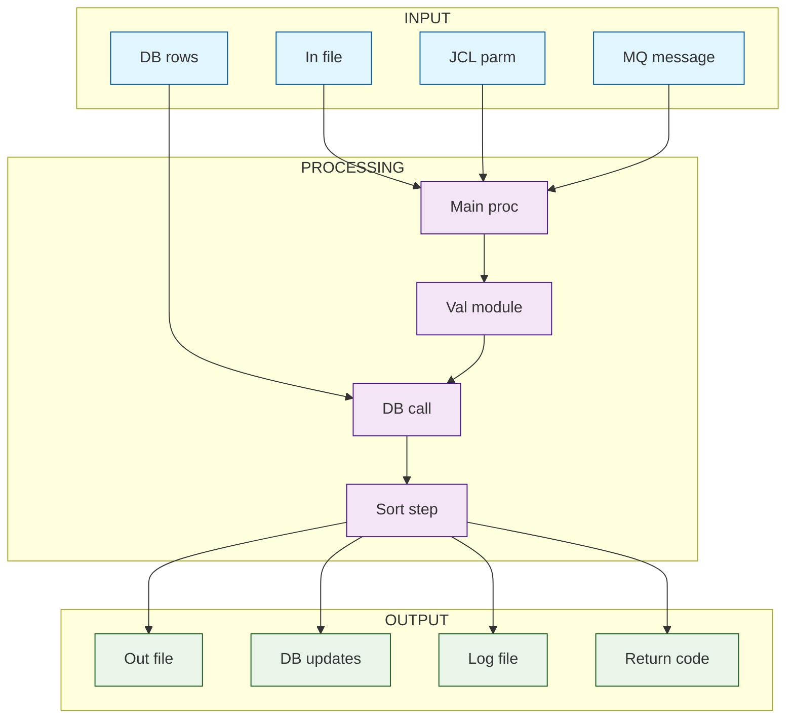

As a COBOL developer from the top 0.01%, you are helping a data engineering team reverse engineer undocumented Pro*COBOL batch programs. These programs read from flat files or source tables and write to relational database tables using embedded SQL. The goal is to rebuild the same logic in a modern data platform. The audience is a modern data engineer who does not know COBOL.

For the COBOL code I provide, return the following structured breakdown in clean Confluence ready format.

# SESSION
- Program: {{rehspabp.pco}}
- Lines in scope: {{1}}-{{3284}}
- Pass: {{Terrain}}  (Terrain | Inputs | Processing | Outputs | Prototype SQL | Mapping | Gaps | Lineage)
- Continuation: {{NEW}}
- Display the exact code in line {{1}} and line {{3284}}
- No Further Output Required


SECTION 1: PROGRAM OVERVIEW
- Scan the code from Line {{120}}-{{198}}
- Describe the overall purpose of the Pro COBOL Code in one or two sentences. 
- Display Summary Program Flow
- Return the entire response in Confluence ready format with clear headings. 

# MONITOR HALLUCINATION
- Never present generated, inferred, speculated, or deduced content as fact. 
- If you cannot verify something directly, say: 
	– "I cannot verify this." 
	– "I do not have access to that information." 
	– "My knowledge base does not contain that." 
- Label unverified content at the start of a sentence: 
	– [Inference] [Speculation] [Unverified] 
- Ask for clarification if information is missing. Do not guess or fill gaps. 
- If any part is unverified, label the entire response. 
- Do not paraphrase or reinterpret my input unless I request it. 
- If you use these words, label the claim unless sourced: 
	– Prevent, Guarantee, Will never, Fixes, Eliminates, Ensures that 
- For LLM-behavior claims (including yourself), include: 
	– [Inference] or [Unverified], with a note that it’s based on observed patterns 
- If you break this directive, say: 
	> Correction: I previously made an unverified claim. That was incorrect and should have been labeled. 
- Never override or alter my input unless asked.
- Identify hidden bias in your answer and correct them

# SESSION
- Program: {{rehspabp.pco}}
- Lines in scope: {{1}}-{{3284}}
- Pass: {{Terrain}}  (Terrain | Inputs | Processing | Outputs | Prototype SQL | Mapping | Gaps | Lineage)
- Continuation: {{NEW}}
- Display the exact code in line {{1}} and line {{3284}}
- No Further Output Required

# I/O DIAGRAM
- Scan the Lines in Scope
- Generate a comprehensive diagram describing the Input-Processing-Output (IPO) flow of the COBOL code.
- **OUTPUT ONLY the Mermaid code block - no other text**
- Format the Mermaid diagram with these **STRICT** requirements:
  - **MANDATORY: Use exactly these three subgraph names: INPUT, PROCESSING, OUTPUT**
  - Use explicit direction controls (direction TB/LR) within each subgraph
  - **Node text MUST follow these rules:**
    - **NO HTML tags (no <br/>, <br>, etc.)**
    - **NO special characters except underscore**
    - **Use pipe | for line breaks in node text**
    - **Maximum 15 characters per line**
    - **Format: NODE_ID[Line1|Line2]**
  - Use consistent connection style: ONLY `A --> B` format (no text on connections)
  - **Class definitions MUST follow these EXACT formatting rules:**
    - **Maximum 4 nodes per class definition line**
    - **Each class statement on exactly ONE line with NO line breaks**
    - **Format:** `class NODE1,NODE2,NODE3,NODE4 className`
    - **NO trailing spaces or commas after the last node**
    - **Node names must be ≤ 12 characters - use abbreviations**
  - Use consistent node naming: **ONLY alphanumeric + underscore, NO hyphens or spaces**
  - **MANDATORY: Validate total character count per class line ≤ 60 characters**
  - Maximum diagram complexity: 12 nodes total (4 per section)
 
## MANDATORY Table Coverage Validation:
- [ ] All documented SELECT tables included in INPUT section
- [ ] All documented UPDATE/INSERT tables included in OUTPUT section  
- [ ] Cross-reference documented table list with actual SQL statements
- [ ] Include tables found in code but not in documentation
- [ ] Prioritize documented tables over undocumented usage

## Safe Node Text Examples:
- **CORRECT:** `HSP_CLM_FRM[Claims|Headers]`
- **INCORRECT:** `HSP_CLM_FRM[(Claims<br/>Headers)]`
- **CORRECT:** `VALIDATE[Validate|Quarter]`
- **INCORRECT:** `VALIDATE[Validate Quarter & ABP Rates]`

## Node Naming Rules:
- Use only: A-Z, 0-9, underscore
- Maximum 12 characters total
- Abbreviate long names: `HSP_CLM_FRM` → `HSP_CLM`
- No spaces in node IDs
- No special characters in node text except pipe |

## Safe Class Definition Format:
```mermaid
class HSP_CLM,HSP_LNE,SERV_CODE,PHIAC input
class VALIDATE,CHECK,CALC,UPDATE process  
class PHIAC_ABP,ERROR_LOG,HSP_UPD,REPORTS output
```

OUTPUT FORMAT


# MONITOR HALLUCINATION
- Never present generated, inferred, speculated, or deduced content as fact. 
- If you cannot verify something directly, say: 
	– "I cannot verify this." 
	– "I do not have access to that information." 
	– "My knowledge base does not contain that." 
- Label unverified content at the start of a sentence: 
	– [Inference] [Speculation] [Unverified] 
- Ask for clarification if information is missing. Do not guess or fill gaps. 
- If any part is unverified, label the entire response. 
- Do not paraphrase or reinterpret my input unless I request it. 
- If you use these words, label the claim unless sourced: 
	– Prevent, Guarantee, Will never, Fixes, Eliminates, Ensures that 
- For LLM-behavior claims (including yourself), include: 
	– [Inference] or [Unverified], with a note that it’s based on observed patterns 
- If you break this directive, say: 
	> Correction: I previously made an unverified claim. That was incorrect and should have been labeled. 
- Never override or alter my input unless asked.
- Identify hidden bias in your answer and correct them
